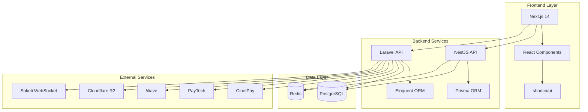

<div align="center">

# 🍽️ RestoConnect360

**La solution SaaS complète pour restaurants en Afrique**

[](https://laravel.com)
[](https://vuejs.org)
[](https://nestjs.com)
[](https://nextjs.org)
[](LICENSE)
[](CONTRIBUTING.md)

[📱 Démo](https://demo.restoconnect360.com) • [📚 Documentation](https://docs.restoconnect360.com) • [🐛 Report Bug](https://github.com/Afriflux/restoconnect360/issues) • [✨ Request Feature](https://github.com/Afriflux/restoconnect360/issues)

</div>

---

## 🌍 À propos

**RestoConnect360** est une plateforme SaaS multi-tenant conçue spécifiquement pour les restaurants, cafés, bars, boulangeries et food trucks en **zone UEMOA** (8 pays d'Afrique de l'Ouest).

### ✨ Points forts

- 🎨 **White Label complet** - Personnalisation totale (couleurs, logos, domaines)
- 💳 **Paiements africains** - CinetPay, PayTech, Wave avec délégation de collecte
- 📱 **QR Codes universels** - Menu, table, commande, facture, fidélité, check-in
- 🏢 **Multi-succursales** - Gestion centralisée de plusieurs établissements
- 🤖 **Automatisations** - Notifications, campagnes, rappels intelligents
- 💰 **Franc CFA (XOF)** - Devise native de la zone UEMOA
- 🌐 **PWA Ready** - Application web progressive installable
- ⚡ **Temps réel** - Soketi WebSockets pour suivi commandes live

---

## 🏗️ Architecture

### Stack Technique

**Backend Principal (Laravel 11)**
```
📦 afriflux-restoconnect360/
├── 🔐 Authentication multi-tenancy
├── 💳 Intégration paiements (CinetPay, PayTech, Wave)
├── 📊 Analytics & Reporting
├── 🤖 Moteur d'automatisations
├── 📱 API REST complète
└── 🗄️ PostgreSQL + Redis
```

**Backend Services (NestJS 10)**
```
📦 restoconnect-backend/
├── 🔑 JWT Authentication
├── 💰 Service délégation collecte
├── 📱 Service QR Codes universels
├── 🎨 Service White Label dynamique
└── 🗄️ Prisma ORM + PostgreSQL
```

**Frontend (Next.js 14 + shadcn/ui)**
```
📦 restoconnect-frontend/
├── 🖥️ Dashboard Super Admin
├── 🏪 Interface Commerce
├── 📱 Mobile-first responsive
├── 🎨 Tailwind CSS + shadcn/ui
└── ⚡ Real-time updates
```

### Diagramme d'Architecture



---

## 🚀 Quick Start

### Prérequis

- **Node.js** 18+ ([Download](https://nodejs.org))
- **PHP** 8.2+ ([Download](https://www.php.net))
- **Composer** ([Download](https://getcomposer.org))
- **Docker** & Docker Compose ([Download](https://www.docker.com))
- **Git** ([Download](https://git-scm.com))

### Installation Express (< 5 minutes)

```bash
# 1. Cloner le repository
git clone https://github.com/Afriflux/restoconnect360.git
cd restoconnect360

# 2. Démarrage automatique avec Docker
chmod +x start-restoconnect360.sh
./start-restoconnect360.sh
```

✅ **C'est tout !** La plateforme sera accessible sur :
- 🎨 **Frontend** : http://localhost:3000
- ⚙️ **Backend NestJS** : http://localhost:3001
- 🔧 **Backend Laravel** : http://localhost:8000
- 👨‍💼 **Super Admin** : http://localhost:3000/super-admin

### Installation Manuelle

<details>
<summary>Cliquez pour voir les étapes détaillées</summary>

#### 1. Services de base (PostgreSQL + Redis)

```bash
docker-compose up -d postgres redis
```

#### 2. Backend NestJS

```bash
cd restoconnect-backend
cp env.example .env
npm install
npx prisma generate
npx prisma migrate dev
npm run start:dev
```

#### 3. Backend Laravel

```bash
cd afriflux-restoconnect360
cp .env.example .env
composer install
php artisan key:generate
php artisan migrate --seed
php artisan serve --port=8000
```

#### 4. Frontend Next.js

```bash
cd restoconnect-frontend
npm install
npm run dev
```

</details>

---

## 📸 Screenshots

<div align="center">

### 🏠 Page d'accueil


### 📊 Dashboard Super Admin


### 🏪 Interface Commerce


### 📱 Mobile Responsive


</div>

---

## 💡 Fonctionnalités

### 🎯 Core Features

| Fonctionnalité | Description | Statut |
|----------------|-------------|--------|
| **Multi-tenancy** | Gestion isolée des commerces | ✅ |
| **White Label** | Personnalisation complète | ✅ |
| **QR Codes** | 6 types universels avec analytics | ✅ |
| **Paiements** | CinetPay, PayTech, Wave | ✅ |
| **Délégation** | Commission 3-5% automatique | ✅ |
| **Automatisations** | Notifications et campagnes | ✅ |
| **Multi-succursales** | Gestion centralisée | ✅ |
| **PWA** | Application installable | ✅ |
| **Real-time** | WebSockets Soketi | 🔄 |
| **Storage** | Cloudflare R2 | 🔄 |

### 📱 Types de QR Codes

- 🍽️ **Menu** - Carte digitale interactive
- 🪑 **Table** - Commande sans contact
- 🛍️ **Order** - Suivi commande client
- 🧾 **Invoice** - Facture numérique
- 🎁 **Loyalty** - Programme fidélité
- ✅ **Check-in** - Réservation et présence

### 💳 Méthodes de Paiement

- **CinetPay** - Mobile Money, Visa, Mastercard
- **PayTech** - Orange Money, Free Money, E-Money
- **Wave** - Transfert instantané sans frais

---

## 💰 Modèle Économique

| Plan | Prix (XOF/mois) | Commandes | Commission | White Label |
|------|----------------|-----------|------------|-------------|
| **Starter** | Gratuit | 0-50 | 5% | ❌ |
| **Pro** | 15,000 | Illimité | 2% | Partiel |
| **Business** | 40,000 | Illimité | 1% | Complet |
| **Enterprise** | Sur devis | Illimité | 0.5% | Complet + Support |

### 💵 Revenus Additionnels

- **Délégation collecte** : 3-5% commission
- **Matériel POS/Kiosk** : 10,000 XOF/mois (location) ou 150,000 XOF (achat)
- **Add-ons** : 5,000-15,000 XOF/mois

---

## 🗂️ Structure du Projet

```
restoconnect360/
│
├── 📁 afriflux-restoconnect360/    # Backend Laravel (principal)
│   ├── app/
│   ├── database/
│   ├── routes/
│   └── resources/
│
├── 📁 restoconnect-backend/        # Backend NestJS (services)
│   ├── src/
│   │   ├── auth/
│   │   ├── payments/
│   │   ├── qr/
│   │   └── branding/
│   └── prisma/
│
├── 📁 restoconnect-frontend/       # Frontend Next.js
│   ├── src/
│   │   ├── app/
│   │   ├── components/
│   │   └── lib/
│   └── public/
│
├── 📄 docker-compose.yml           # Services Docker
├── 📄 start-restoconnect360.sh     # Script de démarrage
└── 📄 README.md                    # Ce fichier
```

---

## 🧪 Tests

```bash
# Tests backend NestJS
cd restoconnect-backend
npm run test
npm run test:e2e
npm run test:cov

# Tests backend Laravel
cd afriflux-restoconnect360
php artisan test
php artisan test --coverage

# Tests frontend Next.js
cd restoconnect-frontend
npm run test
npm run test:e2e
```

---

## 📚 Documentation

- 📖 [Guide d'installation complet](docs/installation.md)
- 🔧 [Configuration](docs/configuration.md)
- 🔐 [Authentification & Sécurité](docs/security.md)
- 💳 [Intégration paiements](docs/payments.md)
- 📱 [QR Codes](docs/qr-codes.md)
- 🎨 [White Label](docs/white-label.md)
- 🚀 [Déploiement](docs/deployment.md)
- 📡 [API Reference](docs/api.md)

---

## 🤝 Contributing

Nous accueillons toutes les contributions ! Voici comment participer :

1. 🍴 Fork le projet
2. 🌿 Créez votre branche (`git checkout -b feature/AmazingFeature`)
3. ✨ Commitez vos changements (`git commit -m 'feat: Add AmazingFeature'`)
4. 📤 Push vers la branche (`git push origin feature/AmazingFeature`)
5. 🔃 Ouvrez une Pull Request

Lisez notre [Guide de contribution](CONTRIBUTING.md) pour plus de détails.

### 🎨 Commit Convention

Nous utilisons [Conventional Commits](https://www.conventionalcommits.org/) :

- `feat:` Nouvelle fonctionnalité
- `fix:` Correction de bug
- `docs:` Documentation
- `style:` Formatage
- `refactor:` Refactoring
- `test:` Tests
- `chore:` Maintenance

---

## 🌍 Roadmap

### Q1 2026
- ✅ Lancement MVP
- ✅ Intégrations paiements
- ✅ QR Codes universels
- 🔄 Real-time avec Soketi
- 🔄 Storage Cloudflare R2

### Q2 2026
- 📱 Application mobile (React Native)
- 🤖 IA pour prédictions de ventes
- 📊 Analytics avancées
- 🌐 Support multilingue étendu

### Q3 2026
- 🚚 Module livraison avancé
- 🏪 Marketplace B2B fournisseurs
- 📱 Intégration WhatsApp Business
- 💼 CRM intégré

### Q4 2026
- 🌍 Expansion zone CEMAC
- 🤖 Chatbot IA support client
- 📈 Tableau de bord BI avancé
- 🔐 ISO 27001 certification

---

## 📄 License

Ce projet est sous licence **MIT**. Voir le fichier [LICENSE](LICENSE) pour plus de détails.

---

## 👥 Équipe

Développé avec ❤️ par **Afriflux** pour révolutionner la restauration en Afrique.

- **Website**: [afriflux.com](https://afriflux.com)
- **Email**: contact@afriflux.com
- **Twitter**: [@Afriflux](https://twitter.com/Afriflux)
- **LinkedIn**: [Afriflux](https://linkedin.com/company/afriflux)

---

## 🙏 Remerciements

- [Laravel](https://laravel.com) - Framework PHP élégant
- [NestJS](https://nestjs.com) - Framework Node.js progressif
- [Next.js](https://nextjs.org) - Framework React de Vercel
- [shadcn/ui](https://ui.shadcn.com) - Composants React réutilisables
- [Prisma](https://prisma.io) - ORM moderne TypeScript
- [Tailwind CSS](https://tailwindcss.com) - Framework CSS utility-first

---

## ⭐ Star History

[](https://star-history.com/#Afriflux/restoconnect360&Date)

---

<div align="center">

**[⬆ Retour en haut](#-restoconnect360)**

Made with 💚 in Africa 🌍

</div>
